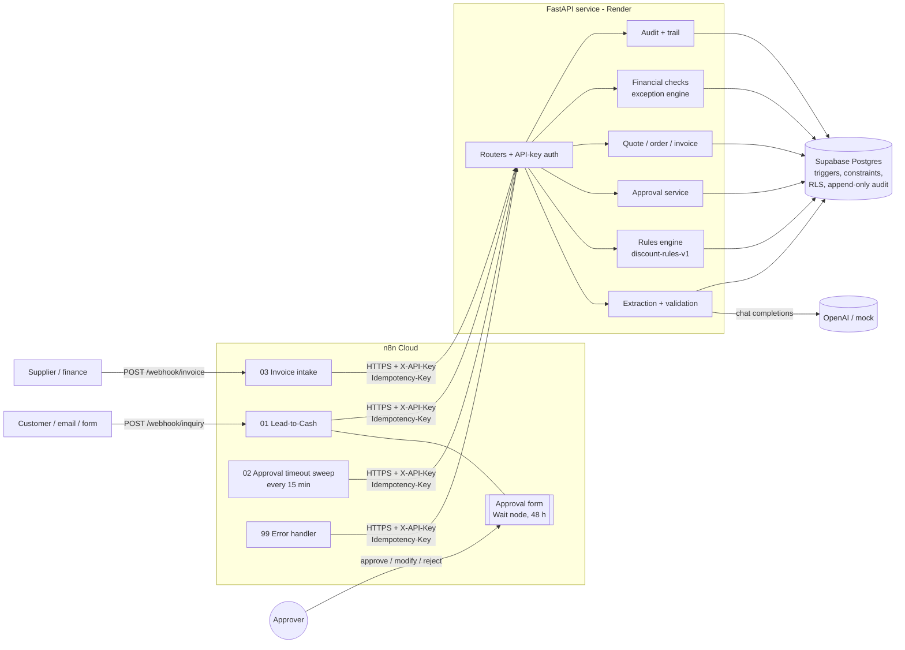
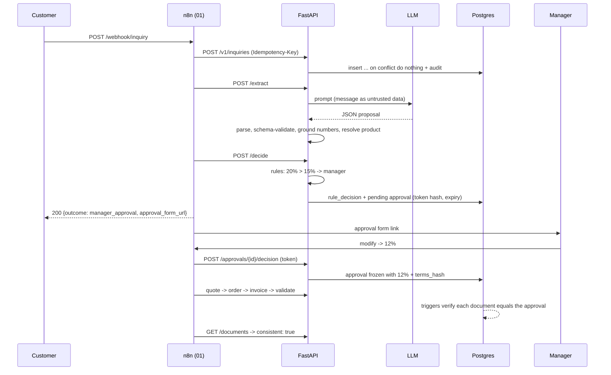
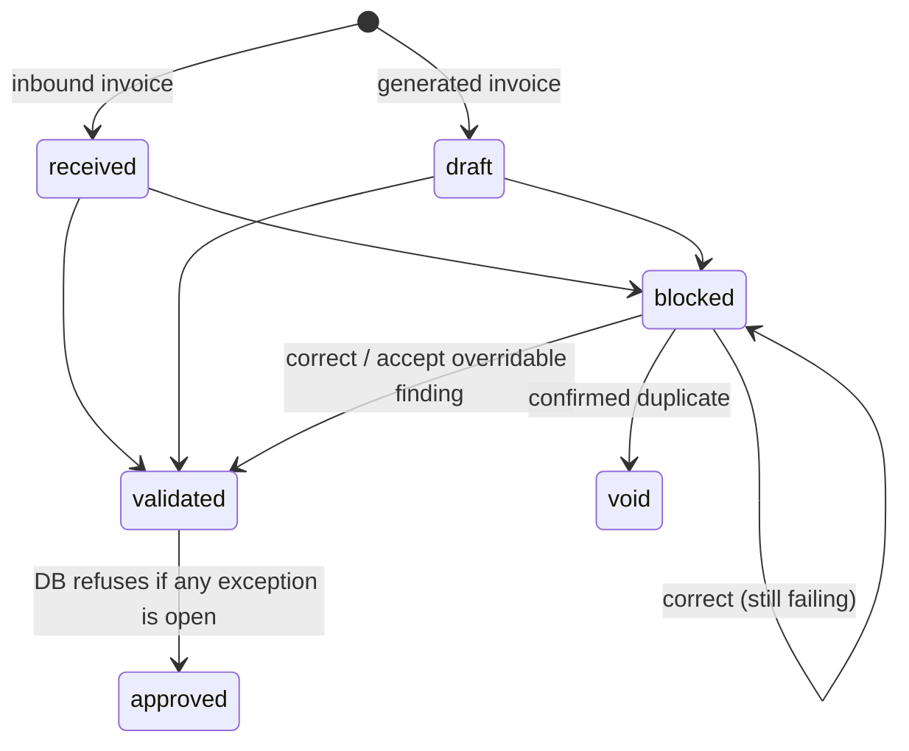

# Architecture

## Principle
**AI proposes, rules and humans decide, the database enforces.**

* **n8n** orchestrates: webhooks, sequencing, retries, human approval form, timeouts, error workflow.
* **Python (FastAPI)** owns every decision: validation, deterministic business rules, pricing,
  approval authority, exception detection, audit.
* **Postgres (Supabase)** is the last line of defence: triggers and constraints make "approved = executed",
  duplicate prevention and append-only audit impossible to bypass, even by buggy application code.
* **The LLM** (OpenAI, or a deterministic mock) only turns unstructured text into a *proposal*, which is
  schema-validated and grounded against the source text before anything uses it.

## Components


## Lead-to-cash sequence (20% requested, manager approves 12%)


## State machines
```mermaid
stateDiagram-v2
    [*] --> received
    received --> extracting
    extracting --> extracted
    extracting --> needs_review: low confidence / unknown product /<br/>missing data / AI down
    extracted --> approved: <= 5% (auto)
    extracted --> awaiting_approval: > 5%
    extracted --> rejected: > 40%
    extracted --> needs_review: missing data / oversized order
    awaiting_approval --> approved: approve / modify
    awaiting_approval --> rejected: reject
    awaiting_approval --> needs_review: timeout (48 h)
    approved --> quoted --> ordered --> invoiced
```


## Where each control lives
| Control | Enforced in |
|---|---|
| Quote/order must equal approved terms | Postgres triggers `quotes_enforce_approval`, `orders_enforce_quote` + `terms_hash` |
| Approver can only reduce, within role authority | Service check + DB constraint `approvals_approved_not_above_requested` |
| Decided approval cannot change | Trigger `approvals_freeze_decided` |
| No duplicate inquiry / quote / order / invoice per order | Unique indexes + `INSERT ... ON CONFLICT` |
| Blocked invoice/expense cannot be approved | Trigger `block_if_open_exceptions` |
| Audit cannot be edited | Trigger `audit_log_append_only` (update, delete, truncate) |
| Public Supabase REST API cannot read data | RLS enabled on every table, no policies |
| AI output cannot be trusted blindly | Pydantic schema, retries with feedback, grounding check, confidence threshold |
